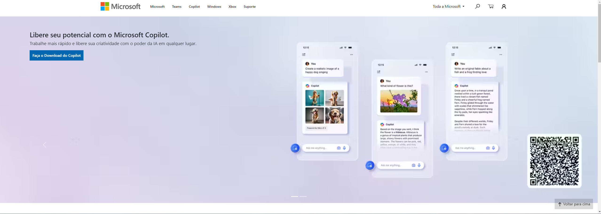
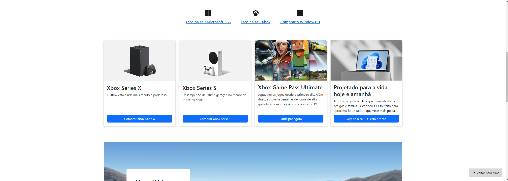
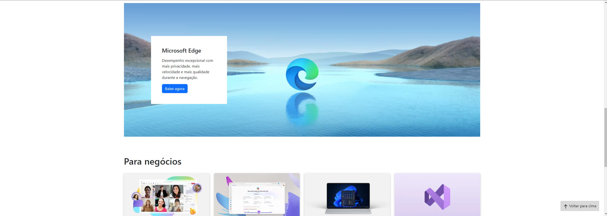
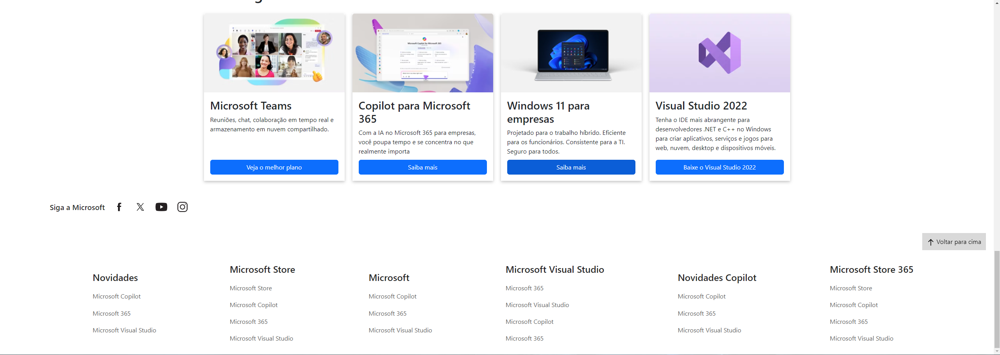

# Microsoft-site
 

<h2> <a href="https://alissonclaro.github.io/Microsoft-site/" target="_blank"> Microsoft-site </a>  <---- Link.</h2>  

 
 
<h2>Projeto referente a treinamento de boas praticas em programação</a></h2>
 
<h2>Imagens do projeto Wide</h2>

 

 

 

.
